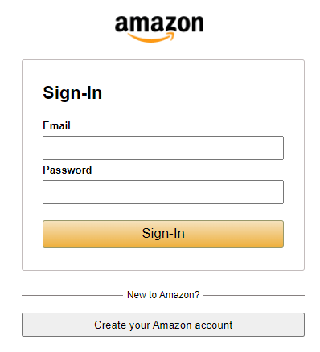
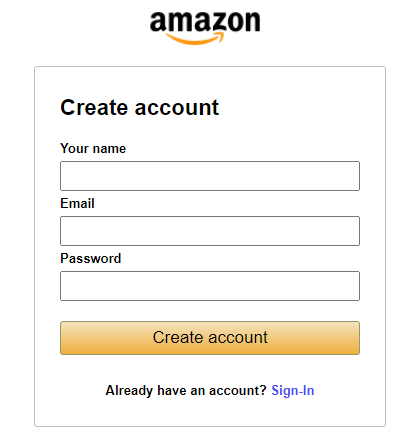

# Amazon app

Here is the live demo https://hoangluan97.github.io/Amazon/
An Ecommerce Store application build with Reactjs, React-router-dom, Redux, Firebase

## Feature

- Search/Sort Products
- Add/Delete User's cart
- Signup/Signin User's account

## Technologies

- HTML, CSS
- React: 17.0.2
- Redux: 8.0.1
- React-router-dom: 6.3.0
- Firebase: 9.8.2

## Screenshots

## Set up

Download or clone the repository

In the project directory, you can run:

npm start
Runs the app in the development mode.
Open http://localhost:3000 to view it in the browser.

The page will reload if you make edits.
You will also see any lint errors in the console.

## Approach

I used all the stuff that I have learned recently to build this app and also applied the BEM naming style for my CSS class names. This project helped me a lot to get used to all of these new knowledge and realize what needs to be learned to develop this app and afford to carry out my new projects
